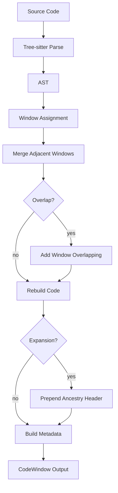
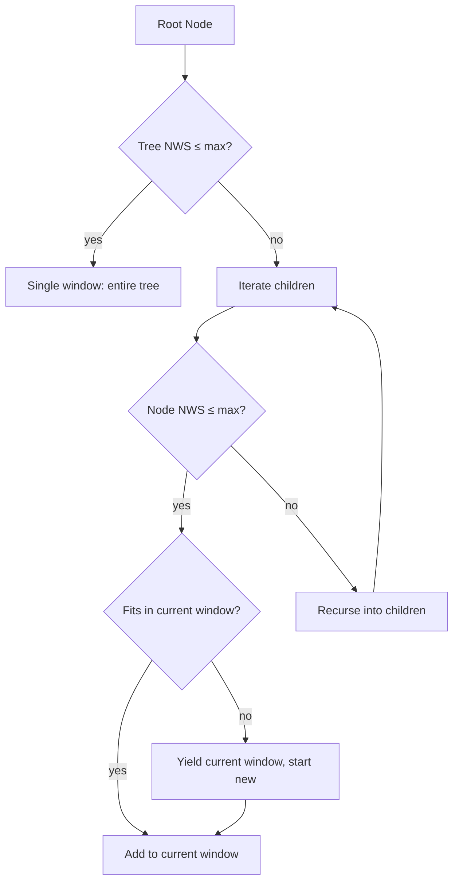

# astchunk

A Rust implementation of AST-based code chunking, reproducing the paper:

> [cAST: Enhancing Code Retrieval-Augmented Generation with Structural Chunking via Abstract Syntax Tree](https://arxiv.org/abs/2506.15655)  
> Yilin Zhang et al.

Original Python implementation: [yilinjz/astchunk](https://github.com/yilinjz/astchunk)

ASTChunk splits source code into chunks while respecting syntactic structure and semantic boundaries, making it suitable for code RAG pipelines.

## Supported Languages

Python, Java, C++, C#, TypeScript, Rust.

## Library Usage

```rust
use astchunk::{AstChunkBuilder, Language};

let code = "def hello():\n    print('hello')\n";
let chunks = AstChunkBuilder::new(Language::Python)
    .max_chunk_size(1500)
    .chunkify(code);
```

### Builder Options

| Method              | Default   | Description                                    |
|---------------------|-----------|------------------------------------------------|
| `max_chunk_size(n)` | 1500      | Maximum non-whitespace characters per chunk    |
| `chunk_overlap(n)`  | 0         | Number of AST nodes to overlap between chunks  |
| `chunk_expansion(b)`| false     | Prepend ancestry context header to each chunk  |
| `template(t)`       | `Default` | Metadata template for output formatting        |
| `repo_metadata(m)`  | empty     | Repository-level metadata (filepath, repo, …)  |

## CLI Usage

```bash
# Install
cargo install --path . --all-features

# Chunk a single file
astchunk src/lib.rs

# Chunk with custom parameters
astchunk -s 1000 --overlap 2 --expansion src/

# Brief summary (no code output)
astchunk --brief src/lib.rs

# JSON output
astchunk --json src/lib.rs

# Read from stdin
cat main.py | astchunk -l python

# View a specific chunk
astchunk --chunk-id 3 src/lib.rs
```

## Algorithm

The cAST algorithm splits source code into semantically meaningful chunks using the Abstract Syntax Tree (AST). Unlike naive line-based or token-based splitters, it preserves syntactic structure — function boundaries, class scopes, and statement blocks remain intact within chunks.

### Pipeline Overview



### Step 1 — Parse

Source code is parsed into an AST using [tree-sitter](https://tree-sitter.github.io/tree-sitter/). Each node in the tree spans a byte range in the source and carries structural type information (e.g., `function_definition`, `class_declaration`).

### Step 2 — Window Assignment

The core step. A **greedy recursive** algorithm assigns AST nodes to **windows** (proto-chunks), respecting the `max_chunk_size` limit measured in **non-whitespace character count** (NWS):



For each level of the tree:
1. If the entire subtree fits within `max_chunk_size`, it becomes a single window.
2. Otherwise, iterate over children. Each child that fits is greedily packed into the current window.
3. When a child does not fit and is itself too large, **recurse** into its children (recording the parent as an ancestor for context).
4. When the current window is full, yield it and start a new one.

### Step 3 — Merge Adjacent Windows

After recursive splitting, adjacent sibling windows (produced at the same recursion level) are **merged** if their combined NWS count still fits within `max_chunk_size`. This reduces over-fragmentation.

### Step 4 — Overlap (optional)

When `chunk_overlap > 0`, each window is extended by borrowing nodes from its neighbors:
- **Prepend** the last *k* nodes from the previous window.
- **Append** the first *k* nodes from the next window.

This creates overlapping context between consecutive chunks, improving retrieval recall.

### Step 5 — Code Rebuilding

Each window of AST nodes is converted back into source text. The algorithm reconstructs newlines and indentation from the original line/column positions — the output is valid, readable code rather than concatenated fragments.

### Step 6 — Chunk Expansion (optional)

When enabled, each chunk is prefixed with an **ancestry context header** showing the file path and the chain of enclosing scopes:

```
'''
src/calculator.py
Calculator
    add
'''
    self.value += x
    return self.value
```

This gives embedding models additional context about where the code lives in the larger structure.

### Step 7 — Metadata & Output

Each chunk is wrapped in a `CodeWindow` with metadata (NWS size, line count, start/end line, node count) according to the chosen template. Four templates are available:

| Template        | Format                                      |
|-----------------|---------------------------------------------|
| `None`          | Content only, empty metadata                |
| `Default`       | filepath, chunk_size, line_count, line range |
| `RepoEval`      | CodeRAGBench RepoEval format                |
| `SwebenchLite`  | CodeRAGBench SWE-bench Lite format          |

