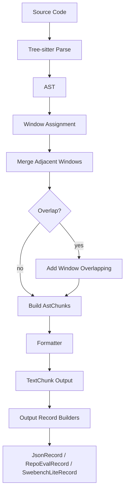
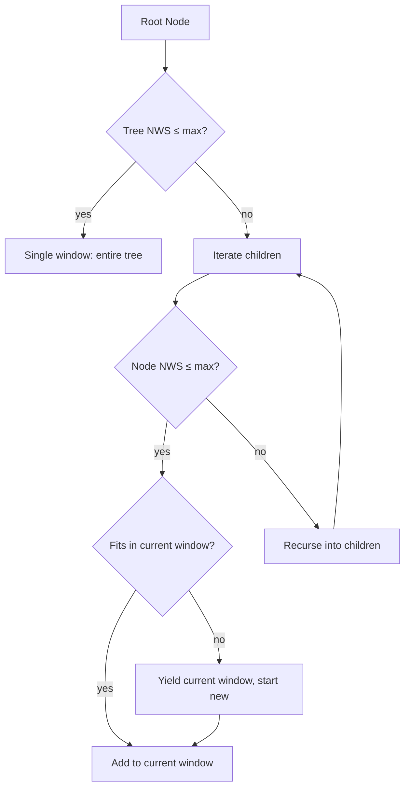

# astchunk

[](https://crates.io/crates/astchunk)
[](https://docs.rs/astchunk)
[](LICENSE)
[](https://github.com/rust-secure-code/safety-dance/)

A Rust implementation of AST-based code chunking, reproducing the paper:

> [cAST: Enhancing Code Retrieval-Augmented Generation with Structural Chunking via Abstract Syntax Tree](https://arxiv.org/abs/2506.15655)  
> Yilin Zhang et al.

Original Python implementation: [yilinjz/astchunk](https://github.com/yilinjz/astchunk)

`astchunk` splits source code into chunks while respecting syntactic structure and semantic boundaries, making it suitable for code RAG pipelines.

## Supported Languages

Python, Java, C++, C#, TypeScript, Rust.

## Library Usage

```rust
use astchunk::chunker::{CastChunker, CastChunkerOptions, Chunker};
use astchunk::formatter::{CanonicalFormatter, Formatter};
use astchunk::lang::Language;
use astchunk::output::JsonRecord;
use astchunk::types::{Document, DocumentId, Origin};

let source = "def hello():\n    print('hello')\n";
let document = Document {
    document_id: DocumentId(0),
    language: Language::Python,
    source: source.into(),
    origin: Origin::default(),
};

let chunker = CastChunker::new(CastChunkerOptions::default());
let ast_chunks = chunker.chunk(&document).unwrap();

let formatter = CanonicalFormatter::default();
let text_chunks = formatter.format(&document, &ast_chunks).unwrap();

let records = JsonRecord::build(&document, &ast_chunks, &text_chunks);
assert_eq!(records.len(), text_chunks.len());
```

Use `ContextualFormatter::default()` instead of `CanonicalFormatter::default()` when you want scope/path headers prepended to each chunk.

### CastChunkerOptions

| Field | Default | Description |
|-------|---------|-------------|
| `max_nws_size` | 1500 | Maximum non-whitespace characters per chunk |
| `overlap_nodes` | 0 | Number of AST nodes to overlap between adjacent windows |

`CastChunkerOptions` is `#[non_exhaustive]`. Outside this crate, start from `Default` and mutate the public fields:

```rust
let mut options = CastChunkerOptions::default();
options.max_nws_size = 1000;
options.overlap_nodes = 2;
```

## CLI Usage

```bash
# Install
cargo install --path . --all-features

# Chunk a single file
astchunk src/lib.rs

# Chunk with custom parameters
astchunk -s 1000 --overlap 2 src/

# Contextual output with ancestry headers
astchunk --expansion src/lib.rs

# Brief summary (no code output)
astchunk --brief src/lib.rs

# JSON output
astchunk --json src/lib.rs

# RepoEval JSON output
astchunk --json --template repo-eval --repo astchunk src/lib.rs

# SWE-bench Lite JSON output
astchunk --json --template swebench-lite src/lib.rs

# Read from stdin
cat main.py | astchunk -l python

# RepoEval from stdin
cat main.py | astchunk -l python --json --template repo-eval --repo astchunk --stdin-path src/main.py

# View a specific chunk
astchunk --chunk-id 3 src/lib.rs
```

`--language` is required when reading from stdin. `--template repo-eval` requires `--repo`, and stdin exports that need a logical path (`repo-eval`, `swebench-lite`) also require `--stdin-path`.

## Algorithm

The cAST algorithm splits source code into semantically meaningful chunks using the Abstract Syntax Tree (AST). Unlike naive line-based or token-based splitters, it preserves syntactic structure: function boundaries, class scopes, and statement blocks remain intact within chunks.

### Pipeline Overview



### Step 1 — Parse

Source code is parsed into an AST using [tree-sitter](https://tree-sitter.github.io/tree-sitter/). Each node in the tree spans a byte range in the source and carries structural type information (for example, `function_definition` or `class_declaration`).

### Step 2 — Window Assignment

The core step is a greedy recursive algorithm that assigns AST nodes to windows (proto-chunks), respecting the configured NWS budget (`CastChunkerOptions::max_nws_size`, exposed as `--max-chunk-size` in the CLI):



For each level of the tree:
1. If the entire subtree fits within the configured budget, it becomes a single window.
2. Otherwise, iterate over children. Each child that fits is greedily packed into the current window.
3. When a child does not fit and is itself too large, recurse into its children while recording the parent chain as ancestry context.
4. When the current window is full, yield it and start a new one.

### Step 3 — Merge Adjacent Windows

After recursive splitting, adjacent sibling windows produced at the same recursion level are greedily merged if their combined NWS count still fits within the configured budget. This reduces over-fragmentation.

### Step 4 — Overlap (optional)

When `overlap_nodes > 0` (CLI: `--overlap`), each window is extended by borrowing nodes from its neighbors:
- Prepend the last *k* nodes from the previous window.
- Append the first *k* nodes from the next window.

This creates overlapping context between consecutive chunks, improving retrieval recall.

### Step 5 — Code Rebuilding

Each window of AST nodes is converted back into source text. The algorithm reconstructs newlines and indentation from the original line and column positions, so the output is valid, readable code rather than concatenated fragments.

### Step 6 — Contextual Formatting

`ContextualFormatter` prepends a scope ancestry header to each chunk, showing the first line of each enclosing definition with 4-space indentation:

```
'''
src/calculator.py
class Calculator:
    def add(self, x):
'''
    self.value += x
    return self.value
```

This gives embedding models additional context about where the code lives in the larger structure. `CanonicalFormatter` outputs plain reconstructed code without any header.

### Step 7 — Output Records

The `output` module converts formatted chunks into serializable downstream records. Three builders are available:

| Builder | Requirements | Format |
|---------|--------------|--------|
| `JsonRecord::build` | none | JSON with optional path/repo metadata, chunk metrics, and line numbers |
| `RepoEvalRecord::build` | `origin.path` and `origin.repo` | CodeRAGBench RepoEval format |
| `SwebenchLiteRecord::build` | `origin.path` and an `instance_id` argument | CodeRAGBench SWE-bench Lite format |

